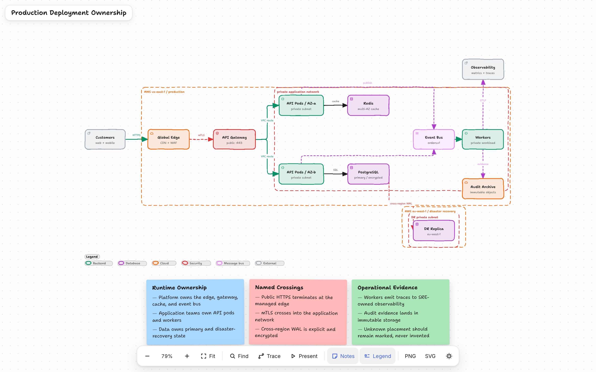
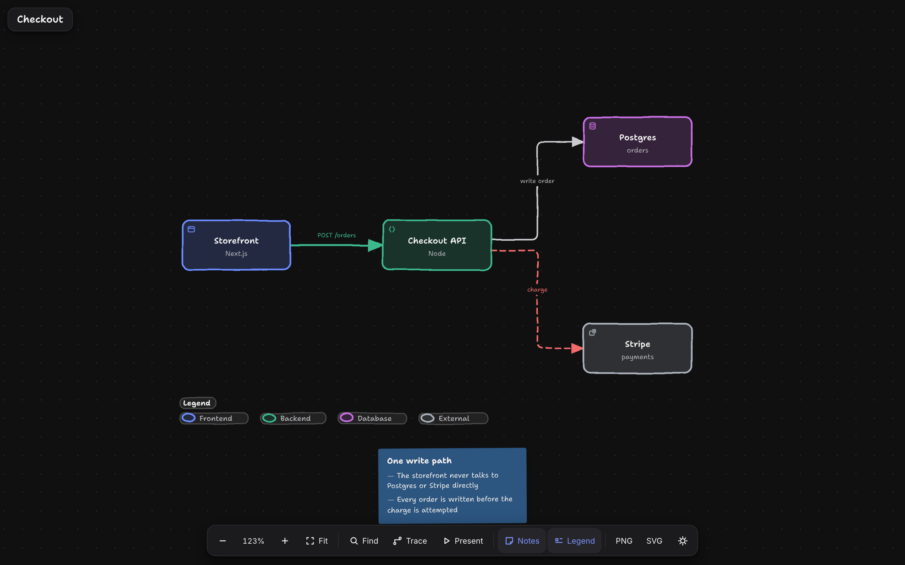

# Arda's DSA Skill

A Claude Code skill that turns a small JSON spec into a self-contained, interactive
HTML diagram that looks hand-drawn. Five types — architecture, workflow, sequence, data
flow, lifecycle. The spec goes through a strict validator first: nine artifact checks
plus composition checks that catch crossed routes, ambiguous corridors, labels sitting
on top of other lines, and text too small to read on a laptop. When something fails you
get the exact node or edge, the measurement behind the complaint, and a list of fixes
that the renderer actually supports. The output is one HTML file with the fonts
embedded — no build step, no server, nothing fetched when someone opens it.





## Quickstart

```bash
git clone <this repo> ~/.claude/skills/dsa
cd ~/.claude/skills/dsa && npm install     # only needed to run the tests

node bin/dsa.mjs validate architecture my-diagram.json --quality showcase --json
node bin/dsa.mjs deliver  architecture my-diagram.json out.html --quality showcase --json
open out.html
```

Inside Claude Code the skill picks the type, reads the matching schema and one example,
writes the spec, and loops on `validate` until it passes.

## A spec

This one validates and delivers as it stands. Four components, three relationships, one
note.

```json
{
  "schema_version": 1,
  "diagram_type": "architecture",
  "meta": { "title": "Checkout", "quality_profile": "showcase", "viewBox": [780, 500] },
  "layout": { "mode": "grid", "origin": [40, 90], "cols": 3, "gapX": 120, "gapY": 70, "cellW": 140, "cellH": 64 },
  "components": [
    { "id": "shop", "type": "frontend", "label": "Storefront",   "sublabel": "Next.js",  "row": 1, "col": 0, "size": [140, 64] },
    { "id": "api",  "type": "backend",  "label": "Checkout API", "sublabel": "Node",     "row": 1, "col": 1, "size": [140, 64] },
    { "id": "db",   "type": "database", "label": "Postgres",     "sublabel": "orders",   "row": 0, "col": 2, "size": [140, 64] },
    { "id": "psp",  "type": "external", "label": "Stripe",       "sublabel": "payments", "row": 2, "col": 2, "size": [140, 64] }
  ],
  "connections": [
    { "from": "shop", "to": "api", "label": "POST /orders", "variant": "emphasis" },
    { "from": "api",  "to": "db",  "label": "write order" },
    { "from": "api",  "to": "psp", "label": "charge", "variant": "security" }
  ],
  "cards": [
    { "dot": "cyan", "title": "One write path", "items": [
      "The storefront never talks to Postgres or Stripe directly",
      "Every order is written before the charge is attempted"
    ] }
  ]
}
```

Component types are `frontend`, `backend`, `database`, `cloud`, `security`,
`messagebus`, `external`. Relationship variants are `default`, `emphasis`, `security`,
`dashed`. `examples/` has thirteen more.

## Commands

| Command | What it does |
|---|---|
| `validate <type> <spec.json>` | Renders to a temp file, runs every check, prints the failures with their fixes. Exit non-zero if anything fails. |
| `deliver <type> <spec.json> <out.html>` | Freezes the spec bytes, renders and checks that snapshot, then replaces the output atomically. Prints SHA-256 and byte counts for both. A failure leaves the previous file untouched. |
| `render <type> <spec.json> <out.html>` | Renders with no checks. |
| `inspect <type> <spec.json>` | Prints the resolved layout as JSON — box positions, route points, the compiler receipt. |
| `check <out.html>` | Re-runs the artifact checks against an HTML file that already exists. |
| `visual-check <out.html>` | Drives Chrome over the DevTools pipe, measures containment at four widths, writes screenshots beside the file. |

Also there: `preview` (live reload while authoring), `migrate` (workflow v1 to v2),
`examples`, `doctor`.

## Rules that keep a diagram readable

- At most twelve primary nodes. Past that, split it.
- One obvious main path. Side branches leave the nearest node on it. Cut a weak edge
  before you reach for a routing control.
- Short labels. A relationship label is semantic — it names a protocol, an action, a
  direction — so shorten the wording rather than deleting it, and only delete it when
  both endpoints already say the same thing.
- Start with automatic routes. Add `via`, `channelX`, `channelY` or `labelAt` only when
  a diagnostic asks for one, one per repair.
- Validate, read the one diagnostic, change only the thing it names, validate again. If
  two rounds in a row do not reduce the error count, the layout is wrong, not the
  spacing.

## In the browser

Scroll or drag to pan, ctrl/cmd-scroll or pinch to zoom. `f` fits, `/` finds a node,
`+`, `-` and `0` zoom, `esc` clears. Trace takes two nodes and animates the shortest
path between them. PNG and SVG export both carry the embedded fonts. Light and dark
follow the OS until you press the toggle.

## Tests

```bash
npm test
```

## Licence

MIT. See `LICENSE`. Notices for third-party code and the embedded fonts are in
`THIRD_PARTY_NOTICES.md`.
